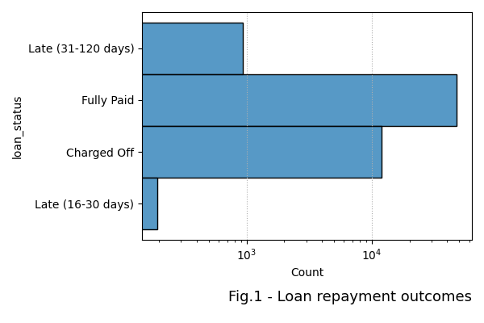
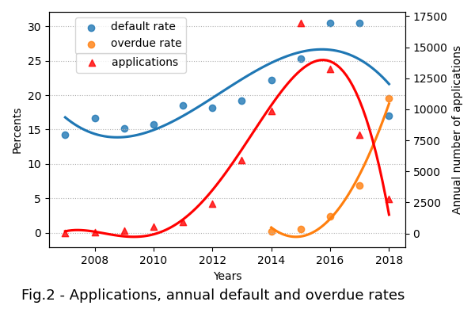
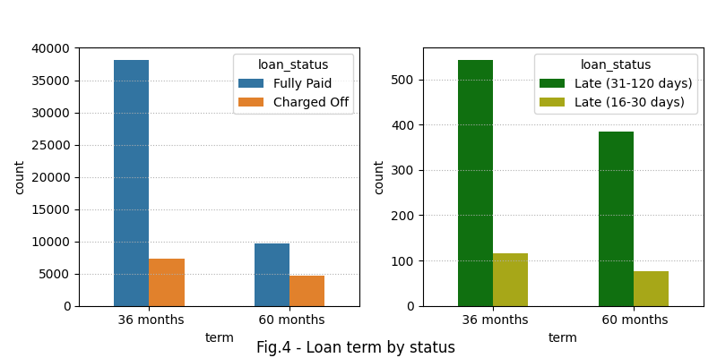
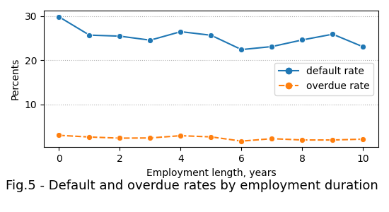
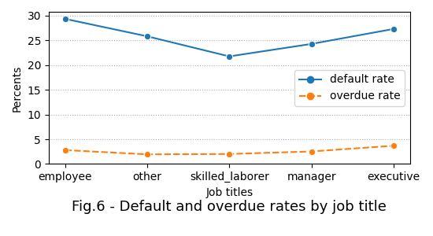
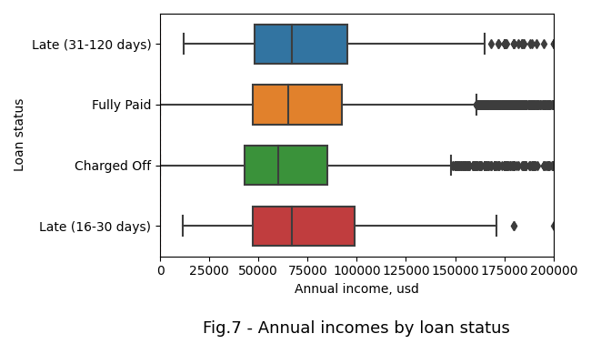
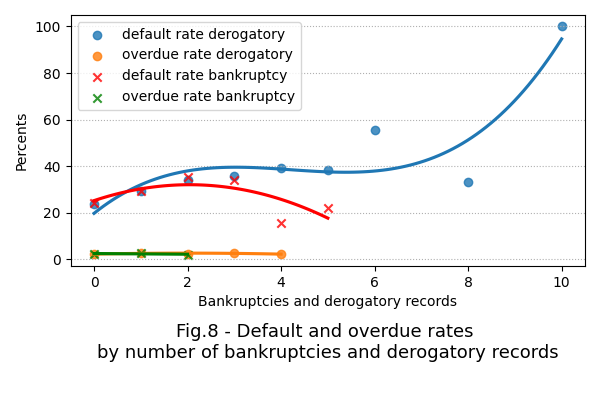
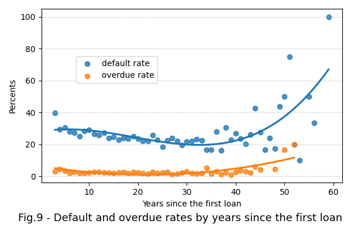

# Loan_repayment

## Content

* [Summary](README.md#Summary)  
* [Project description](README.md#Project-description)  
* [Data and methods](README.md#Data-and-methods)                                
* [Project structure](README.md#Project-structure)                   


---

## Summary

  

## Project description
High competition in the fintech industry pushes companies to innovate. The *LendingClub* company (platform) is the first firm in the US providing peer-to-peer loans between private customers. In addition, the company trades loans on a secondary market. A combination of practical and attractive website, and low interest rates assured fast growth of the client base. This, however, resulted in increase of defaults on the loan repayments rate since current algorythm of the default probability calculation has to be constantly tuned. 

The business objective of the assignment is to identify factors, increasing credit loss of the company such as:
* defaults on the loan repayment
* late installment payments which are subdivided as follows:
    * short overdue (between 16 and 30 days)
    * long overdue (between 31 and 120 days)

An significance estimation of these factors will gradually improves the company profit and provides clients with justified interest rates related to their default risk. 

## Data and methods

Out of a large loan applicantions dataset of 1.6 Gb was taken a sample of some 100,000 entries. The sample contains different applications outcomes which can be seen on the fig.1. To indenitfy negative outcome factors it was selected following distinct categories:
* fully paid
* charged off
* late (31-120 days) and late (16-30 days)

<div align="center"> 
  </div>

### Current credit risk policy

There is no information provided about whether the credit risk assessment policy of the company was changed over time. Analyzing growing default rates and overdue rates over time shown on the fig.2, however, it can be stated that the company had beed issuing more and more risky loans until 2015. Even though the annual default rate has substantially droped form 31% to 18% since 2016, the overdue rate has soared from 2 to 20%. A perilous credit policy resulted in a substantial financial loss.

<div align="center"> 
 </div>

### Features analysis
<details>
  <summary>Features analysis </summary>
The platform categorizes loans by credit risk as shown on the fig.3. Letters from A to G represents the risk category from the lowest to highest level respectively. Analyzing the graph it can be inferred that default rate  smoothly increases by category. Surprisingly, default rate in the group 'G' exceeds Categories B and C contains the majority of all applications (slightly more 30% each).

<div align="center">  </div>

Customers with lower loan grades repay their loans more often in contrast to those with higher loan grades. It implies that the lower the loan ammount the higher probablility of repayment without delay. Taking into account the loans terms distribution shown on the fig.4, it can be added that short-term loans have lower probability of default or overdue. 

<div align="center"> 
  </div>

The default rate slightly decreases from 26% to 22% when applicant's employment duration reaches 5 years, but within the next 2 years it reaches 25% and afterwards remains stable as shown on the fig.5. Taking into account loan applicants job titles shown on the fig.5 it can be said, that skilled laborers have lower default probability in contrast to that of other job titles. Notably that overdue rate is equal to 3 % for every job title.  

<div align="center"> 
  </div>

Applicants with lower annual incomes are more prone to defaul unlike those with larger annual incomes as shown on the fig.6. Probably financial difficulties affect applicats' ability to repay their loans. The feature yet contains multiple outliers exceeding the range of $mean \pm 3 * st.diviation$.

<div align="center"> 
 </div>

</details>

## ML model
The gradien boosting model was applied to identify hidden interrelationship between features. The model classifies default accounts from fully paid ones with high precision as showh on the fig.8.

<div align="center"> 
 </div>

It is essential that the interest rate is the most significant factor of the default. The rate is calculated using the annual income, the loan amount.

## Project structure

<details>
  <summary>display project structure </summary>

```Python
Loan_repayment
├── .gitignore
├── config
│   └── config.json     # configuration settings
├── data                # data archive
│  
├── figures
│   ├── fig_1.png
.....
│   └── fig_xx.png
├── models              # models and weights
│   ├── xxx.pkl
.....
│   └── xxx.pkl
├── notebooks           # notebooks
│   └── Loan_repayment.ipynb

├── README.md
├── requirements.txt    
└── utils               # functions and data loaders
    └── reader_config.py
```
</details>
